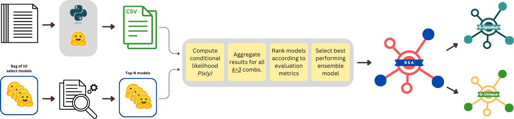
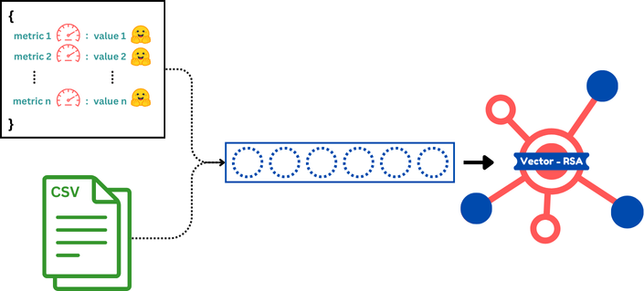

# Multi-Model Rational Speech Act Framework for Scientific Peer Reviews Summarization
[Read The Paper](https://github.com/alialhousseini/glimpse-mds/blob/main/other/paper/NLP_final.pdf)

This repository contains the code and resources for our enhanced multi-document summarization project, building on the foundational work of the GLIMPSE paperwork <a href="#ref1">[1]</a> . Our extensions include various *new* mechanisms to enhance current results, and to improve the performance of summarization for scholarly reviews.

## Overview
### 1. The RSA Framework
The Rational Speech Act (RSA) framework is a probabilistic model of communication that interprets human language use as a process of inference. <a href="#ref2">[2]</a>

### 2. Multi-Document Summarization
Multi-Document Summarization (MDS) is the process of automatically generating a concise summary from multiple source documents that discuss the same or related topics. Unlike single-document summarization, which condenses information from a single text, MDS must handle redundant, complementary, and sometimes conflicting information from different sources.

### 3. RSA for MDS
- The increase in conference submissions (e.g., ICLR, ACL) has placed a burden on area chairs, who must read multiple reviews to make decisions.
- Existing multi-document summarization approaches focus on consensus but fail to highlight divergent opinions.
- We propose "GLIMPSE", our new project work for MDS using **RSA-based scoring mechanisms**. 
- GLIMPSE generates more **informative and concise summaries** compared to existing consensus-based summarization models, thanks to the formulation of RSA as a **reference game**.



## General Architecture
- The process starts by *pre-processing* a set of scholarly reviews
- Later, we generate **Extractive** and **Abstractive** summaries for the selected set of documents
- For the abstractive case, the following models are used:
  1. BART <a href="#ref3">[3]</a>
  2. Pegaus-Arxiv <a href="#ref4">[4]</a>
  3. Pegasus-Large <a href="#ref4">[4]</a>

- In parallel to this branch, a set of models is introduced, and the following steps are performed:

  1. A bag of 10 models is present
  2. An intensive experimental studies were conducted 
  3. A set of evaluations were done to select `Top N` (N=3) models for computing conditional likelihood probability (text vs summary)

- For each of the produced dataset (1 extractive and 3 abstractive) we perform the following set of steps:

  1. Compute the conditional likelihood probability (perplexity) using the top N models
  2. Aggregate results (likelihoods) for all `k=3` combinations out of the `N` extracted models
  3. Rank results based on evaluation metrics. Set of metrics are:

      3.a BERT Score

      3.b ROUGE-1 , ROUGE-2, ROUGE-L, ROUGE-LSum

      3.c UniEVAL <a href="#ref5">[5]</a>
      
      3.d SEAHORSE <a href="#ref6">[6]</a>
  4. Select Top-performing ensemble models combination result's for RSA-scoring
  5. Use GSpeaker and GUnique mechanisms from RSA framework to generate most unique and informative summaries

## Extended Architecture
To enrich our work, we decided to extend our architecture by introducing **Vectorized-RSA**, in this part we define first a set of `pairs` where each pair consist of `key=Evaluation Metrics` and `value=Summarization Model`. 

In this case, and for each dataset, we return a vector of size `n` equal to the number of `metrics` of interest. Each element of this vector represents the alignment of such (text, summary) with that metric.

E.g. First cell measures `fluency` of the generated summary, while the second cell may focus on computing `consistency` of the generated summary.

The set of models used for each metric were select by a extensive set of studies and experimentations.

Finally, this vector is fed to the *Vector-RSA* framework to generate both `GUnique` and `GSpeaker` summaries.




## Code Structure

### 1. Data
This directory contains the required data to replicate this work.

`data_to_process` contains the Top-226 selection of document reviews.

`candidates` are the generated extractive and abstractive summaries 

### 2. Glimpse

  #### Baselines
  Set of scripts to replicate SOTA techniques
  
  *Example usage:*
  ```python
    python sumy_baselines.py 
      --input_folder data/candidates/ 
      --batch_size 32 
      --device "cuda" 
      --output_folder data/candidates_sumy/
  ```

  #### Data Loading
  Set of scripts to load original data, and to crawl required data from `open_review`

  *Example usage:*
  ```python
    python data_preprocessing.py
  ```

  #### Evaluate
  Set of scripts to evaluate a set of summaries
  *Example usage:*
  ```python
    # Returns same datasets with an additional column containing the BERTScore
    python evaluate_bartbert_metrics.py 
      --input_folder data/candidates/ 
      --output_folder data/candidates/
  ```

  #### Src
  Set of scripts used for computing likelihood probabilities and RSA-based scores

  *Example usage:*
  ```python
    python compute_rsa.py 
      --input_folder {input_folder} 
      --output_folder {output_folder} 
      --model "facebook/bart-large-cn" --device "cuda"
  ```

### 3. MDS
MDS (Multi-document summarization) contains a set of folders to generate `GSpeaker` and `GUnique` summaries. The directory contains also some scripts for aggregating set of likelihood matrices.

### 4. RSASUMM
The RSA and Vect-RSA frameworks

### Where to start
It is highly recommended to follow the steps provided in `main_notebook.ipynb` where each step is documented, and results can be easily visualized


## Acknowledgment

We would like to extend our sincere gratitude to Professor [Luca Cagliero](https://www.polito.it/personale?p=023058), Teaching Assistant [Lorenzo Vaiani](https://www.polito.it/personale?p=lorenzo.vaiani), Teaching Assistant [Giuseppe Gallipoli](https://www.polito.it/personale?p=giuseppe.gallipoli) for their invaluable guidance, support, and insights throughout the course of this project. Their expertise and encouragement have been instrumental in the successful completion of our work.


## References
<a id="ref1">[1]</a> Maxime Darrin, Ines Arous, Pablo Piantanida, and Jackie Cheung. 2024. GLIMPSE: Pragmatically Informative Multi-Document Summarization for Scholarly Reviews. In Proceedings of the 62nd Annual Meeting of the Association for Computational Linguistics (Volume 1: Long Papers)

<a id="ref2">[2]</a> Michael C. Frank, Noah D. Goodman , Predicting Pragmatic Reasoning in Language Games. *Science336,998-998(2012).* DOI:10.1126/science.1218633

<a id="ref3">[3]</a> Lewis, Mike. "Bart: Denoising sequence-to-sequence pre-training for natural language generation, translation, and comprehension." arXiv preprint arXiv:1910.13461 (2019).

<a id="ref4">[4]</a> Zhang, Jingqing, et al. "Pegasus: Pre-training with extracted gap-sentences for abstractive summarization." International conference on machine learning. PMLR, 2020.

<a id="ref5">[5]</a> Clark, Elizabeth, et al. "SEAHORSE: A multilingual, multifaceted dataset for summarization evaluation." arXiv preprint arXiv:2305.13194 (2023).

<a id="ref6">[6]</a> Zhong, Ming, et al. "Towards a unified multi-dimensional evaluator for text generation." arXiv preprint arXiv:2210.07197 (2022).
